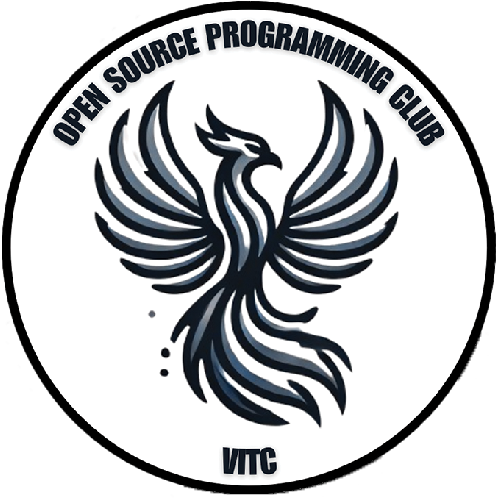

# Open Source Programming Club (OSPC) - VIT Chennai

  

Welcome to the **Open Source Programming Club (OSPC)**! We're a community of passionate developers, designers, and tech enthusiasts at VIT Chennai, dedicated to promoting open-source development and fostering innovation.

## 🚀 Mission

Our mission is to inspire and empower students to contribute to open-source projects, enhance their technical skills, and become active participants in the global developer community.

## 🛠 Activities

As a member of OSPC, you'll get to engage in various activities that support our mission:

- **Workshops:** Interactive sessions on trending technologies, programming languages, and tools
- **Hackathons:** Quick, challenging coding events to test and build your problem-solving skills
- **Projects:** Opportunities to collaborate on real-world projects, contributing to the open-source ecosystem
- **Meetups:** Regular meetings to discuss the latest in tech, share ideas, and network

## 🎉 Events

Throughout the year, we organize events like:

- **Hackathons**
- **Coding Challenges**
- **Guest Talks** with industry professionals
- **Open-source Sprints**

## 🌟 Join Us

Whether you're a beginner or an experienced developer, OSPC welcomes everyone who shares a passion for open-source! Join us to learn, code, and connect with like-minded individuals.

## 📫 Contact

For any inquiries or to get involved, reach out to us via:

## 📊 Stats

